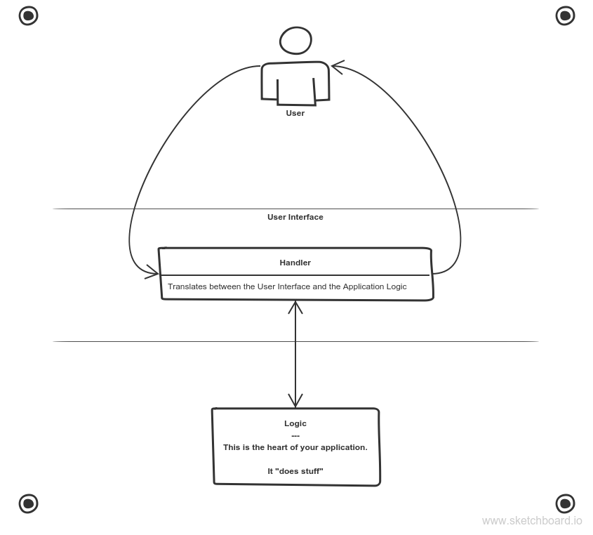

# Separation of Concerns

> "The most important principle in Software Engineering is the Separation of Concerns (SoC):
> The idea that a software system must be decomposed into parts that overlap in functionality as little as possible."
>
> - [Effective Software Design](https://effectivesoftwaredesign.com/2012/02/05/separation-of-concerns/)

## Contents

- [Learning Objectives](#learning-objectives)
- [About the Projects](#about-the-projects)
- [Suggested Study](#suggested-study)
- Practice
  - [Isolate](./isolate/index.html)
  - [Integrate](./integrate/index.html)
  - [Exercises](#exercises)
- Sundays & Projects
  - [Week 1](#week-1)
  - [Week 2](#week-2)
- [Class Recordings](./class-recordings.md)
- [Curriculum](https://home.hackyourfuture.be/curriculum) (external)
- [HYF Home](https://home.hackyourfuture.be/) (external)

---

## Learning Objectives

### Isolating JavaScript

- Creating DOM elements
- Reading & writing from DOM element properties
  - `.innerHTML`
  - `.value`
  - `.style`
  - ...
- Attaching event listeners to DOM objects
- Writing _event handlers_
  - Using `Event` objects as parameters
  - Structuring user interactions in handler functions
- Using template strings to create HTML strings

### Integrating JavaScript

- Document Life-Cycle
  - `<head>`: Scripts & styles are loaded top to bottom, before the `<body>`
  - `<body>`: Everything is executed/loaded top to bottom
  - so what? Any DOM script should be written/loaded _below_ the element it interacts with
- JS & the DOM
  - Adding event listeners to the DOM by `id`
  - Reading & Writing values from DOM elements
  - Using HTML strings and `.innerHTML` to update the DOM
  - Using template literal strings to render HTML
  - The beginnings of DOM manipulation
- Handling events:
  - Reading user data from events
  - Implementing user stories with this data
- Organizing your code based on it's _role_ in your program
  1. _DOM_: define the structure of your user interface
  2. _Styles_: define the display of your user interface
  3. _Event Listeners_: define _how_ users will interact with your program
  4. _Handlers_: define _what_ happens when a user interacts with your program
  5. _Logic_: define & test how user data is transformed
- Incremental Development 2.0:
  - Develop your projects one user-story at a time ...
  - AND develop your user stories one step at a time!
  - Carefully complete & test one piece of code before writing the next

[TOP](#separation-of-concerns)

---

## About the Projects



Projects in this module will be more challenging than in the last module, adding even a little interactivity into a website will make things much more complicated! To help you deal with this complexity you will practice separating and organizing your JavaScript code into different files based on what role it plays in your application.

### Interactive UI

You will learn how to create interactive User Interfaces by reading and writing from the DOM:

- Users will pass input to your programs directly from the UI (no more `prompt`)
- Users will see results displayed directly in the UI (no more `alert`)

Projects in this module will not include full DOM manipulation, you'll learn that in the next module. This module's projects will be limited to reading/writing `.innerHTML` & `.value`.

### Decoupled Code

In this module you will learn how to completely separate your JavaScript from your user interface. You will be using `.getElementById` and `.addEventListener` instead of the `onclick` attribute.

When using `onclick`, you need to write some JavaScript in your HTML - this is not a good practice because your UI and JavaScript are too interdependent. Using HTML `id`s and JavaScript _event listeners_ you can **decouple** your User Interface from the program logic.

### DOM Event Listeners

Web development is fundamentally _event driven_, this means things don't happen until a something else happens. In your previous projects the `prompt` didn't appear until the user clicked a button and a prompt appeared. You've probably noticed by now that this is a limiting way to write your programs. It's hard to gather interesting data from a user, and impossible to display it in a nice way.

You will learn how to use _DOM events_ to interact with users and to read more interesting data than just a few words or numbers. Things like mouse movements, the colors on a screen, and much more.

### Separating your Concerns

A working project is not enough! For projects in this module we will expect you to turn in code that is well organized in different files based on it's role. The first week's project will come with some starter-code to help you get used to the folder structure we expect. The `using-user-input` exercises will also act as a guide & practice for building well-structured projects.

### Development Strategy

Just like in the previous module, you will be expected to explain your development strategy in a separate file called `development-strategy.md`. Projects involving JavaScript are naturally more complicated than projects with only `prompt` & `alert`, for this reason you will be expected to structure the user stories in your `development-strategy` files differently than you did in the last module. To get an idea of how to describe your strategies in this module, take a look at the `using-user-input` exercises. (psst, it's like writing documentation!)

### Git Branching

In this module’s project you have many more files and folders, and you’re learning how to break a single feature into more smaller pieces. To implement a single user story you will need HTML, CSS, event listener(s), handler(s) and possibly a logic function. All of these smaller tasks can be shared between different team mates.

The extra branching challenge this module is to create different branches for each user story like before, but then to also create branches off of the user story branches for the smaller units of work. This way your group can confirm your work before merging it into the feature, and confirm the feature before merging it to master

So it’s not about how many commits are on a branch, but how much work is on a branch. If you only commit once for your piece of work then there will be only commit on a branch, but that’s the measure

Good luck!

[TOP](#separation-of-concerns)

---

## Suggested Study

- Separation of Concerns
  - [Jon Bellah](https://jonbellah.com/articles/separation-of-concerns/)
  - [stackexchange](https://softwareengineering.stackexchange.com/questions/32581/how-do-you-explain-separation-of-concerns-to-others)
  - [Colocation](https://kentcdodds.com/blog/colocation)
- Code in this Repo
  - 🥚 [/isolate](./isolate?hyf): focus on the DOM and events, isolating JavaScript in the debugger
  - 🥚 [/integrate](./integrate?hyf): learn how to integrate JS into user interfaces built with HTML and CSS
  - 🥚 [/stepped](./stepped?hyf): study HTML/CSS/JS projects built up step-by-step (only examples)
  - 🥚 [/separated](./separated?hyf): study HTML/CSS/JS projects that have been separated by concern (only examples)
  - 🥚 [/refactor-and-test](./refactor-and-test?hyf): practice refactoring the logic from user interactions and testing it in isolation
- JavaScript 30
  - [javascript30.com](https://javascript30.com/)
  - [YouTube Playlist](https://www.youtube.com/playlist?list=PLu8EoSxDXHP6CGK4YVJhL_VWetA865GOH)
  - [wesbos/JavaScript30](https://github.com/wesbos/JavaScript30)
  - [Group Project Guide](https://github.com/HackYourFutureBelgium/javascript-30)
  - [Group Project Starter Repo](https://github.com/HackYourFutureBelgium/javascript-30-starter)
- Repos to Study
  - [hyfbe/dom-manipulation](https://github.com/HackYourFutureBelgium/dom-manipulation)
  - [hyfbe/listeners-and-handlers](https://github.com/HackYourFutureBelgium/listeners-and-handlers)
  - [hyfbe/handler-refactors](https://github.com/HackYourFutureBelgium/handler-refactors)
  - [hyfbe/using-user-events](https://github.com/HackYourFutureBelgium/using-user-events)
  - [hyfbe/calculator-refactor](https://github.com/HackYourFutureBelgium/calculator-refactor)
  - [bradtraversy/vanillawebprojects](https://github.com/bradtraversy/vanillawebprojects)
- [Generating HTML with Template Literals](https://wesbos.com/template-strings-html)
- The DOM
  - [javascript.info/document](https://javascript.info/document)
  - [super highly recommended DOM tutorial](https://dom-tutorials.appspot.com/static/index.html)
  - [Zac Gordon](https://www.youtube.com/watch?v=l-0nPnSvbX8&list=PLruo2gSoqlej-QjRW25c97socsRiAUVuf&index=8)
  - [Traversy](https://www.youtube.com/watch?v=0ik6X4DJKCc)
  - [study.hackyourfuture.be](https://study.hackyourfuture.be/javascript/dom-manipulation)
- Events
  - [what are events?](https://www.youtube.com/watch?v=gx0oAgvXyE4) (mmtuts)
  - [`onclick` vs. `.addEventListener('click', handler)`](https://www.youtube.com/watch?v=7UstS0hsHgI)
  - [javascript.info/events](https://javascript.info/events)
  - [javascript.inf/event-details](https://javascript.info/event-details)
  - [MDN Building Blocks](https://developer.mozilla.org/en-US/docs/Learn/JavaScript/Building_blocks/Events)
  - [Event Delegation (mosh)](https://programmingwithmosh.com/javascript/javascript-event-bubbling-and-event-delegation/)
  - [Bubble & Capture (dev.to)](https://dev.to/shimphillip/handing-javascript-events-efficiently-with-bubble-and-capture-4ha5)

[TOP](#separation-of-concerns)

---

## Week 1

The focus of week 1 is using _event listeners_, _event handlers_ and _DOM elements_ to add interactivity to your web pages. You will learn how to read and write basic data from the DOM.

### Prep Work

- Study
  - [javascript.info/document](https://javascript.info/document)
  - [javascript.info/events](https://javascript.info/events)
  - [`onclick` vs. `.addEventListener('click', handler)`](https://www.youtube.com/watch?v=7UstS0hsHgI)
  - [What are event listeners in JS?](https://www.youtube.com/watch?v=jqU3uaRgQyQ)
- Practice
  - [isolate/01-dom-elements](../isolate/01-dom-elements)
  - [integrate/01-add-event-listener](../integrate/01-add-event-listener)

### Lesson Plan

#### Isolate

- [isolate/01-dom-elements](../isolate/01-dom-elements)
- [isolate/02-read-write-dom](../isolate/02-read-write-dom)

#### Integrate

- [integrate/01-add-event-listener](../integrate/01-add-event-listener)
- [integrate/02-read-write-dom](../integrate/02-read-write-dom)

### Project

There's an outstanding series of tutorials called [The JavaScript 30](https://javascript30.com/) put together by [Wes Bos](https://wesbos.com), it's 30 fun frontend projects with video tutorials and finished code to study. The team project this week is to study one of the projects and reconstruct it as a collaborative project.

Each team member should fork [HackYourFutureBelgium/javascript-30](https://github.com/HackYourFutureBelgium/JavaScript-30), this repo contains more detailed instructions for the week's project. You can use the [javascript-30-starter](https://github.com/HackYourFutureBelgium/javascript-30-starter) repo to get off the ground.

No need to stop at 1 project! If your team is on a roll, keep going. There's a lot of projects :)

#### Checklist

```md
- [ ] [repo](https://github.com/_/_) with a complete README
- [ ] [live demo](https://_.github.io/_)
- [ ] [development-strategy](https://github.com/_/_/tree/master/development-strategy.md)
- [ ] [One branch per step in `development-strategy.md`](https://github.com/_/_/network)
- [ ] [One closed issue per task](https://github.com/_/_/issues?q=is%3Aissue+is%3Aclosed) (you can have more than task per development step!)
- [ ] [One closed PR per task issue](https://github.com/_/__/pulls?q=is%3Apr+is%3Aclosed)
- [ ] [A project board](https://github.com/_/_/projects/X)
```

[TOP](#separation-of-concerns)

---

## Week 2

The focus of week 2 is using forms to handle more gather and process more user data.

### Prep Work

- Study
  - [js.info: Bubbling & Capturing](https://javascript.info/bubbling-and-capturing) (`event.target`)
  - [js.info: Event Delegation](https://javascript.info/event-delegation)
  - [Gordon: DOM Events](https://www.youtube.com/watch?v=QE1YQnhntgw)
  - [Griffith: JS Event Listeners](https://www.youtube.com/watch?v=EaRrmOtPYTM)
  - [Event Delegation (mosh)](https://programmingwithmosh.com/javascript/javascript-event-bubbling-and-event-delegation/)
  - [Event Delegation (all things JS)](https://www.youtube.com/watch?v=6NMSCh3DJug)
  - [Event Delegation (dcode)](https://www.youtube.com/watch?v=pKzf80F3O0U)
- [Isolate](./isolate/index.html)
  - HTML Templates
  - Element Children
  - DOM Manipulation
- [Integrate](../integrate/index.html)
  - Read & Write DOM

### Lesson Plan

#### [Isolate](../isolate/index.html)

- Event Parameter

#### [Integrate](../integrate/index.html)

- Event Delegation

### Project

Just like last week, choose a JavaScript 30 project to reverse-engineer as a team.

#### Checklist

```md
- [ ] [repo](https://github.com/_/_) with a complete README
- [ ] [live demo](https://_.github.io/_)
- [ ] [development-strategy](https://github.com/_/_/tree/master/development-strategy.md)
- [ ] [One branch per step in `development-strategy.md`](https://github.com/_/_/network)
- [ ] [One closed issue per task](https://github.com/_/_/issues?q=is%3Aissue+is%3Aclosed) (you can have more than task per development step!)
- [ ] [One closed PR per task issue](https://github.com/_/__/pulls?q=is%3Apr+is%3Aclosed)
- [ ] [A project board](https://github.com/_/_/projects/X)
```

[TOP](#separation-of-concerns)

---

# Class Recordings

- **Students**: Here you can find recordings of this module from past classes. Enjoy!
- **Coaches**: When sending your PR's with links please ...
  - Indicate which class you were teaching
  - Which week it was (if the module is more than 1 week)
  - Give your name
  - and a helpful description

## class-9-10

> [Laurent](https://github.com/LaurentVB), [Koen](https://github.com/koenvd), [Charles](https://github.com/cpauwels), [Evan](https://github.com/colevanderswands)

### Week 1

- [DOM Elements & Event Listeners (isolate)](https://vimeo.com/444028096), [... continued](https://vimeo.com/444028096)
- [Event Listeners & DOM Elements (integrate)](https://vimeo.com/444028594)
- [.innerHTML vs. .value & Recap](https://vimeo.com/manage/444029311)

### Week 2

- [The `event` Parameter](https://vimeo.com/444026774)
- [Event Delegation](https://vimeo.com/444027091/)
- [Recap Integrate](https://vimeo.com/444027329/)

## class-11-12

[TOP](#separation-of-concerns)

---


